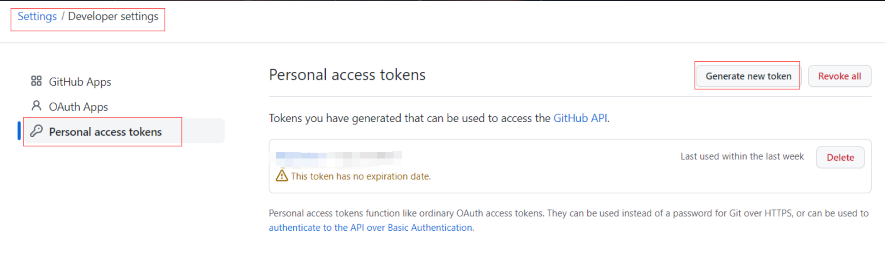
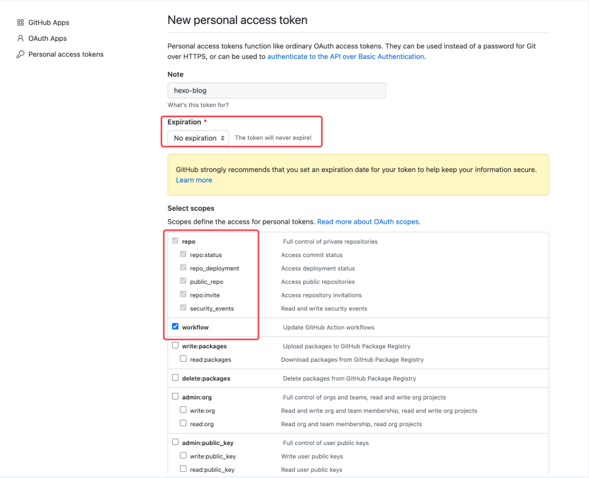
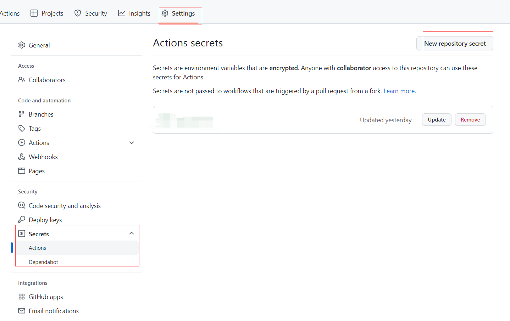

# Hexo搭建

#hexo 
# 基于Hexo搭建私人博客

### 前言

> Hexo 是一个快速、简洁且高效的博客框架。Hexo 使用 [Markdown](http://daringfireball.net/projects/markdown/)（或其他渲染引擎）解析文章，在几秒内，即可利用靓丽的主题生成静态网页。
> > -- <cite>Hexo官方</cite>

Hexo的官网：[链接](https://hexo.io/zh-cn/)

# 1. 安装与配置Hexo

> 安装Hexo前的准备工作：
> 	1. 安装好node.js (hexo官方建议版本不低于10.13，建议使用12.0及以上) 和 git <div style="font-color: blank; font-size: 12px;">不会安装node和git的自行百度或查看hexo官方文档</div>
> 	2. 注册github或gitee的账号
> 	3. 安装一个idea工具，以方便操作git和配置hexo。

## 1.1 安装

win+R：cmd。全局安装hexo-cli，用来创建hexo项目。

```sh
npm install hexo-cli -g
```

安装完成后，在打算放hexo代码的地方，新建文件夹 hexo-blog

```sh
hexo init hexo-blog # 语法 hexo init <folder> 会在直接文件夹中创建hexo项目
cd hexo-blog
npm install/yarn install
```

完成后目录

```plaintext
.  
├── _config.yml # 网站的基础配置，文档：https://hexo.io/zh-cn/docs/configuration  
├── package.json  
├── scaffolds # 文章模板  
├── source  
|   ├── _drafts  
|   └── _posts # 你的 markdown 文章就需要存放在此目录下  
└── themes # 存放主题源码
```

本地启动，看看效果

```sh
hexo server # 本地启动服务，默认端口4000，报错占用后可以使用 hexo server -p xx

访问 http://localhost:4000
```

## 1.2 安装配置主题

以[hexo-theme-fluid](https://github.com/fluid-dev/hexo-theme-fluid)主题为例 

### 1.2.1 npm安装

Hexo 5.0.0 版本以上，推荐通过 npm 直接安装，进入博客目录执行命令：

```sh
npm install --save hexo-theme-fluid
# 或
yarn add hexo-theme-fluid
```

在博客目录下(hexo-blog)， 创建`_config.fluid.yml`，将主题的[_config.yml](https://github.com/fluid-dev/hexo-theme-fluid/blob/master/_config.yml)的内容复制进去。

### 1.2.2 源码安装

下载 [最新 release 版本 (opens new window)](https://github.com/fluid-dev/hexo-theme-fluid/releases)解压到 themes 目录，并将解压出的文件夹重命名为 `fluid`。

这样会有一个在博客目录下的`_config.yml`称为博客配置，`theme/fluid/_config.yml`或新建的`_config.fluid.yml`称为主题配置。

### 1.2.3 应用主题

安装完成后，需修改 Hexo 博客目录中的 `_config.yml`
如下：

```yml
theme: fluid  # 指定主题

language: zh-CN  # 指定语言，会影响主题显示的语言，按需修改
```

重启启动服务，就可在本地看到主题效果了。

之后就按照[官方手册]([配置指南 | Hexo Fluid 用户手册 (fluid-dev.com)](https://hexo.fluid-dev.com/docs/guide/))配置主题，开始属于自己的创造时间。

### 1.2.4 更新主题

1. npm 安装的，直接用npm更新

```sh
npm update --save hexo-theme-fluid
```

2. 通过release压缩包安装的，且没修改过代码的
	1.  先将原文件夹重命名为别的名称，例如 `fluid-bkp`，用于升级失败进行回退；
	2.  按照安装步骤，重新下载 [release (opens new window)](https://github.com/fluid-dev/hexo-theme-fluid/releases)并解压重命名为 `fluid`；
	3.  如果某些配置发生了变化（改名或弃用），release 的说明里会特别提示，同步修改原配置文件即可。

# 2. 使用github pages部署Hexo

`github`提供了`pages`功能, 分别是user pages和project pages, 区别如下:

|   |  User Page | Project Page | 
| --- | --- | --- |
| 是否多个 | 一个帐号只有一个 | 可以有多个, 每个repo都可以有对应的Project page |
| repo and branch | repo名必须为`<username>.github.io`, 页面在master上| repo名随意, 页面必须在分支`gh-pages`下 |
| URL | `http(s)://<username>.github.io`| `http(s)://<username>.github.io/<projectname>`|
两种都可以用于对hexo的部署，本次以第一种UserPage演示。

## 2.1 创建github仓库

### 方式一：双仓库管理，直接使用Github actions部署。

方便管理hexo博客代码，隐藏博客配置中的私密信息。
1. 创建一个私有仓库`blog-source`，用来存放hexo项目的源码
2. 创建一个公有仓库`<username>.github.io`，来作为githubPages的部署仓库。
3. 初始化本地Hexo项目，将代码推送到repo：`blog-source`上。

### 方式二：双分支管理，手动自动部署方式任君选用。

1. 创建一个名为`<username>.github.io`的公有仓库
2. 初始化本地Hexo项目，将代码推送到仓库中。
3. 创建一个新的分支 release
```sh
git checkout -b release
git push --set-upstream origin release # 上传 release 分支
```

### 本地初始化git后，新建.gitignore文件
```text
.DS_Store

node_modules

/dist

.obsidian/workspace

# hexo files

/.deploy_git

/public  

  

# Log files

npm-debug.log*

yarn-debug.log*

yarn-error.log*

  

# Editor directories and files

.idea

.vscode

*.suo

*.ntvs*

*.njsproj

*.sln

*.sw?

*.code-workspace
```

## 2.2 开启Github Pages

### 1. ~~手动开启~~(有自动化，谁还用手动啊)

### 2. 使用Hexo的deploy指令部署

1. 首先在本地hexo项目目录下安装hexo-deploy-git
```sh
npm install hexo-deploy-git --save
# 或
yarn add hexo-deployer-git
```
2. 修改`_config.yml` 的deploy项
```yaml
deploy:  
  type: git  
  ## git@github.com:<username>/<username>.github.io.git 需要配置sshkey
  ## https://github.com/<username>/<username>..github.io.git
  repo: git@github.com:<你的github用户名>/<你的github用户名>.github.io.git  
  branch: release # 这个是要用来展示的分之
```

对于方式一来说，repo的格式必须用ssh形式，并对`<username>.github.io`配置deploy key。
对于方式二，两种格式都可以，ssh需要配置好ssh key；https需要输入账户密码登录

3. 执行  `hexo deploy(简写 hexo d)` 即可完成自动化部署.

### 3. 使用github action自动化部署

关于 Github Action，详细教程可以查看 [官方文档](https://docs.github.com/cn/actions)。按照文档中所描述的，只要我们在代码中添加一层 `.github/workflows` 目录，并且在目录下创建一个 `yml` 文件来描述具体的行为，就可以实现开启 Github Action。
1. 创建Secrets token: 
	1. 在github头像，点击 `Setting` -> `Developer settings` -> `Persona access token`
    > 该token十分重要，泄漏后立马重置。
	2. 
	3. 
	4. 生成token后，复制他(后续无法再查看)，到要设置actions的博客仓库(方式一的`blog-source`)，选择 `Secrets -> Actions -> New repository secret`
	5. 
	6. Name填写HEXO_DEPLOY， Value 填写刚刚复制的token，完成创建。

2. 添加`blog-deploy.yml`
```yml
name: Deploy hexo blog

on:

  push:

    branches:

      - "master" # master 分支有 push 行为时就触发这个 action

jobs:

  build-and-deploy:

    runs-on: ubuntu-latest

    steps:

      - uses: actions/checkout@v3

        with:

          ref: "master"

  

      - name: Setup node

        uses: actions/setup-node@v3

        with:

          node-version: "14"

  

      - name: Setup yarn & Install node_modules

        uses: borales/actions-yarn@v3.0.0

        with:

          cmd: install

  

      - name: Check yarn & node version

        run: |

          echo "Node version is `node -v`"

          echo "Yarn version is `yarn -v`"

  

      - name: Build & Deploy

        run: |

          git config --global user.name "GitHub Action"

          git config --global user.email "action@github.com"

          sed -i'' "s~git@github.com:~https://${{ secrets.HEXO_DEPLOY }}@github.com/~" _config.yml

          rm -rf .deploy_git

          yarn clean

          yarn build

          yarn deploy
```
2. 提交上传代码，就可以看到创建的workflow在actions在运行了。
3. 确保创建的workflow可以完整运行，之后push代码后，都会自动触发部署你的博客了。

#### 补充
对于方式一，我们还需要对我们的部署仓库`<username>.github.io`配置一个deploy key。

1. 新建一个文件夹Key，在改目录下输入指令
```sh
ssh-keygen -f github-deploy-key
```
2. 一路回车，得到两个文件，私钥文件 `github-deploy-key` 和公钥文件 `github-deploy-key.pub`
3. 在`<username>.github.io`仓库`Settings -> Deploy keys -> Add deploy key`
	1.  在 `Title` 输入框填写 `HEXO_DEPLOY_PUB`
	2.  在 `Key` 输入框填写 `github-deploy-key.pub` 文件内容
	3.  勾选 `Allow write access` 选项

##### ps
	- [博客](https://blog.esunr.xyz/2022/06/64163235c30f.html#1-1-%E5%AE%89%E8%A3%85)
	- [美化效果](https://blog.csdn.net/weixin_43471926/article/details/109798811)
